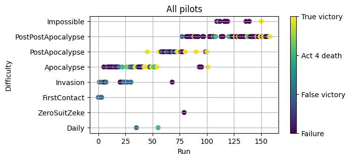
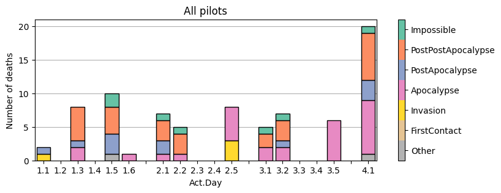
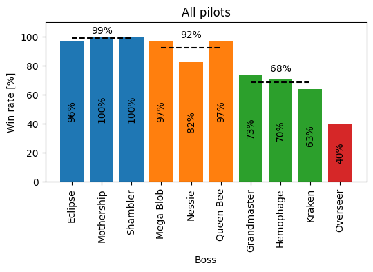
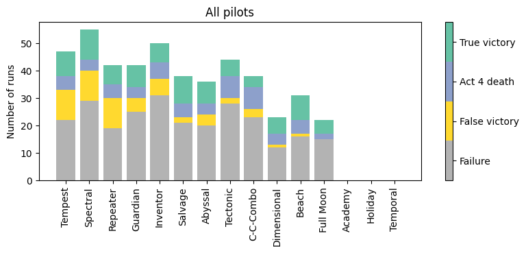
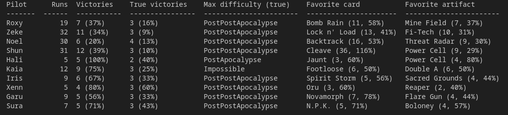

## StarVadersStats

Just a small package to plot stuff from your StarVaders run history.

## Pre-requisites
- [Python](https://www.python.org/)


## Setup
- Install the dependencies:

```bash
pip install -r requirements.txt
```

- Copy the ```history``` directory from your StarVaders save data into the ```data``` directory.
    - Path to save data for Windows:

    ```
    C:\USER\AppData\LocalLow\Pengonauts\StarVaders\saves
    ```
    - Path to save data for Flatpak Steam install on Linux:
    ```
    ~/.var/app/com.valvesoftware.Steam/.steam/steam/steamapps/compatdata/2097570/pfx/drive_c/users/steamuser/AppData/LocalLow/Pengonauts/StarVaders/saves/
    ```

## Running

- Import and instantiate SVStats

```python
from src.StarVadersStats import SVStats
svs = SVStats(
    #Optionally supply path to history directly
    #Required if history is not copied to data-directory
    rundir = None
)
```

- Plot run success:
```python
fig, ax = svs.plot_runSuccess(
    pilot=None #Optionally filter to specific pilot or class
)
```


- Plot final room for failed runs:
```python
fig, ax = svs.plot_finalRoom(
    pilot=None #Optionally filter to specific pilot or class
)
```


- Plot win rate versus the different bosses:
```python
fig, ax = svs.plot_bossWinRate(
    pilot=None #Optionally filter to specific pilot or class
)
```


- Plot your runs with the different packs:
```python
fig, ax = svs.plot_packSuccess(
    pilot=None #Optionally filter to specific pilot or class
)
```


- Print overview table:
```python
svs.print_pilot_table()
```
